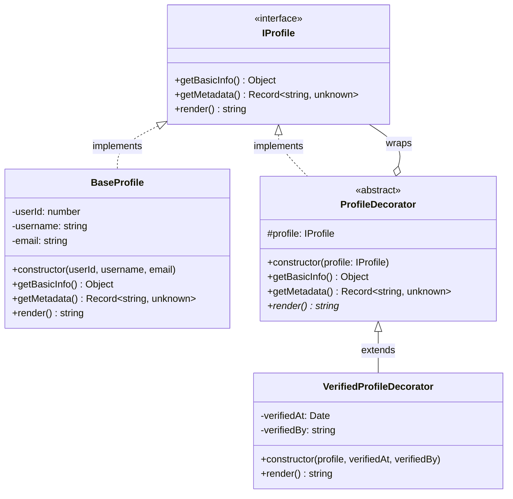

# Decorator Pattern - User Profiles

## Overview

This module implements the **Decorator Pattern** for user profiles, allowing dynamic addition of features to profile objects without modifying their base structure.

The pattern enables:
- **Flexible composition**: Add verification badges, premium features, or role information dynamically
- **Open/Closed Principle**: Extend profile functionality without modifying existing code
- **Single Responsibility**: Each decorator handles one specific feature

## Architecture

### UML Class Diagram



### Component Responsibilities

#### IProfile Interface
Defines the contract for all profile objects:
- `getBasicInfo()`: Returns core user data (userId, username, email)
- `getMetadata()`: Returns additional metadata (timestamps, etc.)
- `render()`: Serializes profile to JSON string

#### BaseProfile
Concrete implementation providing basic profile functionality:
- Stores immutable user information
- Renders JSON with only basic fields
- No additional features

#### ProfileDecorator (Abstract)
Base class for all decorators:
- Holds reference to wrapped profile
- Delegates `getBasicInfo()` and `getMetadata()` to wrapped profile
- Forces subclasses to implement custom `render()` logic

#### VerifiedProfileDecorator
Adds verification badge to profiles:
- Wraps any `IProfile` implementation
- Adds `verified`, `verifiedAt`, `verifiedBy` fields
- Preserves all base profile data

## Usage Examples

### Basic Profile

```typescript
import { BaseProfile } from './base-profile';

const profile = new BaseProfile(1, 'johndoe', 'john@example.com');
// Output: {"userId":1,"username":"johndoe","email":"john@example.com"}
```

### Verified Profile

```typescript
import { BaseProfile } from './base-profile';
import { VerifiedProfileDecorator } from './verified-profile.decorator';

const baseProfile = new BaseProfile(1, 'johndoe', 'john@example.com');
const verifiedProfile = new VerifiedProfileDecorator(
  baseProfile,
  new Date('2026-04-27T12:00:00Z'),
  'admin@example.com'
);

);
// Output: {
//   "userId": 1,
//   "username": "johndoe",
//   "email": "john@example.com",
//   "verified": true,
//   "verifiedAt": "2026-04-27T12:00:00.000Z",
//   "verifiedBy": "admin@example.com"
// }
```

### Accessing Basic Info

```typescript
const info = verifiedProfile.getBasicInfo();

// Output: { userId: 1, username: 'johndoe', email: 'john@example.com' }
```

## Extending with New Decorators

To add new profile features, create a new decorator class:

```typescript
import { IProfile } from './interfaces';
import { ProfileDecorator } from './profile-decorator.abstract';

export class PremiumProfileDecorator extends ProfileDecorator {
  constructor(
    profile: IProfile,
    private readonly premiumSince: Date,
    private readonly tier: string,
  ) {
    super(profile);
  }

  render(): string {
    const baseData = JSON.parse(this.profile.render());
    return JSON.stringify({
      ...baseData,
      premium: true,
      premiumSince: this.premiumSince.toISOString(),
      tier: this.tier,
    });
  }
}
```

### Decorator Composition

Decorators can be stacked to combine multiple features:

```typescript
const baseProfile = new BaseProfile(1, 'johndoe', 'john@example.com');
const verifiedProfile = new VerifiedProfileDecorator(
  baseProfile,
  new Date(),
  'admin@example.com'
);
const premiumVerifiedProfile = new PremiumProfileDecorator(
  verifiedProfile,
  new Date(),
  'gold'
);

);
// Output includes both verified AND premium fields
```

## Design Principles

### Open/Closed Principle
- **Open for extension**: Add new decorators without modifying existing code
- **Closed for modification**: BaseProfile and existing decorators remain unchanged

### Single Responsibility
- Each decorator handles exactly one feature (verification, premium, etc.)
- Base profile only handles core user data

### Liskov Substitution
- All decorators implement `IProfile` interface
- Decorators can be used interchangeably with base profiles

## Testing

All components have comprehensive unit tests:
- **BaseProfile**: 3 tests (basic info, render positive, render negative)
- **VerifiedProfileDecorator**: 3 tests (delegation, verification, preservation)

Run tests:
```bash
npm test -- "src/users/domain/decorator"
```

## Future Extensions

Potential decorators to implement:
- `PremiumProfileDecorator`: Add premium badge and tier information
- `RoleProfileDecorator`: Add role-based information (admin, moderator, etc.)
- `AchievementProfileDecorator`: Add user achievements and badges
- `StatisticsProfileDecorator`: Add user activity statistics

---

**Pattern**: Decorator  
**Domain**: User Profiles  
**Created**: 27 de Abril, 2026
